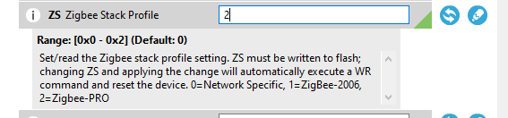
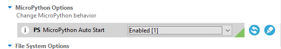
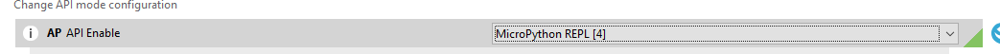

# XBEE3 configutaion

- ZS: Zigbee stack profile 
    - Options: ` 0=Network Specific, 1=ZigBee-2006, 2=Zigbee-PRO`
    - Set: `2`

    

- Micropython 
    - Mode: `Autostart`

    

- API mode
    - MicroPython REPL
    
    

